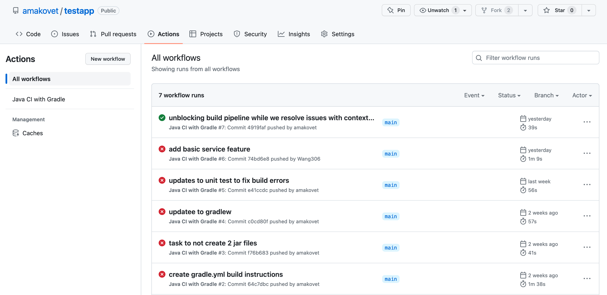
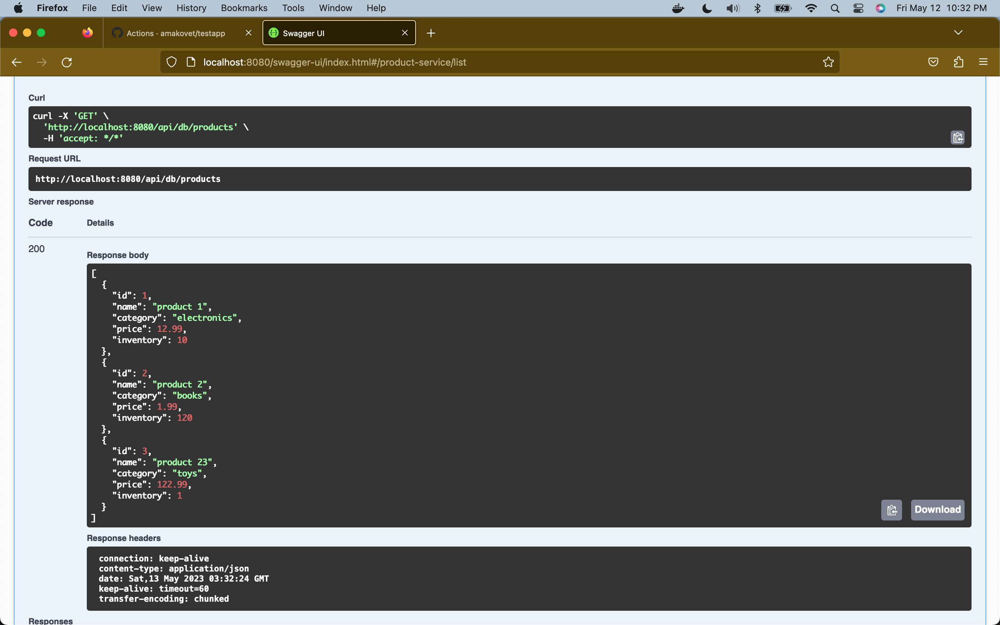
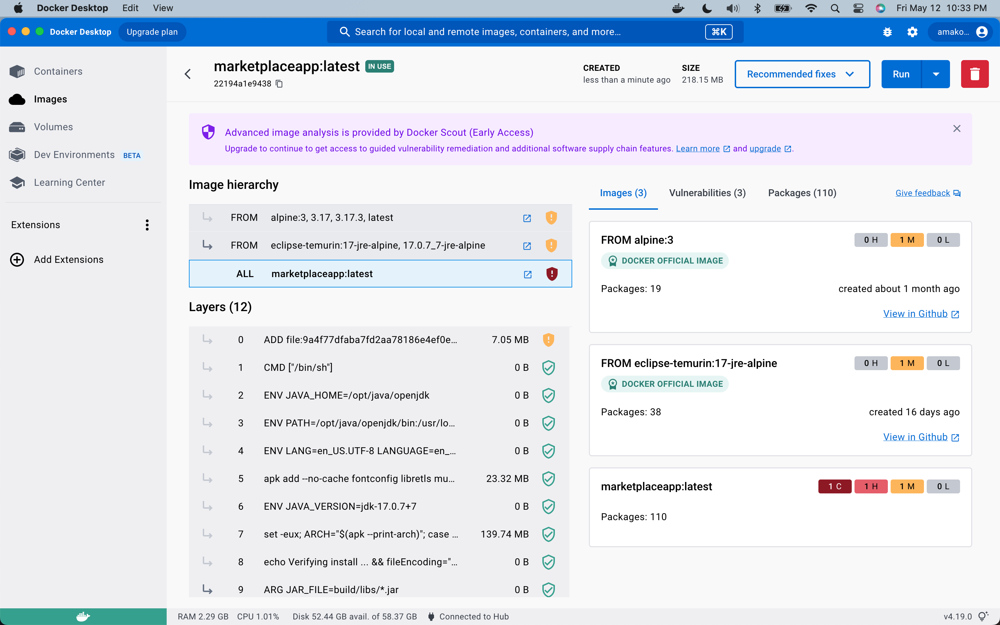

# Purpose

- Milestone 1: Sample project code added to Git from Spring template to let the team get familiar with Spring and practice git. Defined project and initial set of features areas team will work on.

- Milestone 2: Starting initial set up of respective feature area's of the marketplace application; including H2 db data persistence, unit tests.

- Milestone 3: Setting up build and deployment pipelines. Adding in service layers in feature areas.
   

## Project Members

| Member  | Feature                  | Notes                                                                                                                                                                                                                                                                               |
| ------- | ------------------------ | ----------------------------------------------------------------------------------------------------------------------------------------------------------------------------------------------------------------------------------------------------------------------------------- |
| Ke      | Search                   | <i>Determine the search requirements: first need to understand the application search requirements, such as what to search for (product name, description, price, etc.), how to sort the search, the search results paging, etc.</i>                                                |
| Zining  | Shopping Cart & Payments | <i>Shopping Cart may contains function: addProduct, deleteProduct, editQuantity, cartTotal.   Payment may contains function: changePaymentMethod, checkOut</i>                                                                                                                   |
| Alex    | Products                 | <i>Considering adding elements specific to products such as Categories, Product details, Pricing, Taxes, but also elements of Inventory Managagment for keeping track of stocked items,etc...Will continue for start of Milestone 2 define scope</i>                                |
| Pritesh | User & Merchant Module   | <ul><li>Sign-up and sign-in for different users based kn thier user roles, profile setup with contact and delivery details</li><li>stock management, merchant profile setup, delivery status update</li><li>theses features can be part of the user and merchant modules.</li></ul> |

 

## Conflict Resolution

First we will try to work through a conflict as a team, then we will try to vote, if there is a tie we will use a random number generator.
 

## Communication Mechanism

Discord is primary for both chat and meetings, email will be back-up.

 

## Decision Made

| #   | Area                  | Decision                    | Alternative | Rationale                                                                                     |
| --- | --------------------- | --------------------------- | ----------- | --------------------------------------------------------------------------------------------- |
| 1   | IDE                   | Will use VS Code as primary | IntelliJ    | Team is familiar with VS Code editor and IntelliJ                                             |
| 2   | Dependency Management | Gradle                      |             | Team prefers to stay away from XML                                                            |
| 3   | Code                  | Lombok                      |             | Team has little experience with Lombok, and is intrigued to learn & practice                  |
| 4   | Initial DB            | H2                          |             | Team ageed that it would be a quick way for us to get started with setting up our application |

 

## Lessons Learned

 

## Meeting Notes

| #  | Date      | Note                                                                                                                                                                                                                                         | Participants              |
| -- | --------- | -------------------------------------------------------------------------------------------------------------------------------------------------------------------------------------------------------------------------------------------- | ------------------------- |
| 1  | 3.31.2023 | The team will consider best way to update git to set up project, for week 1 and Milestone 1 we are using a sample spring template with no project functionality as team is not familiar with Spring and also wants a project to practice git | Alex, Ke, Zining          |
| 2  | 4.7.2023  | Team is going to start to shell in their features in scope of getting started with Milestone 2 and related SQL set up. We also set a goal for next week to start aligning on a data contract between our features                            | Alex, Ke, Zining, Pritesh |
| 3  | 4.14.2023 | Team discussed progress on Milestone 2 objectives individually. No blockers identified.                                                                                                                                                      | Alex, Ke, Zining          |
| 4  | 5.26.2023 | Team is going to finalize the project in upcoming week.                                                                                                                                                                                      | Pritesh, Alex, Ke, Zining |

 

## Appendix

 
Working code example(s) by Alex

Docker - Local run by Alex

 

Working code example(s) by Pritesh

