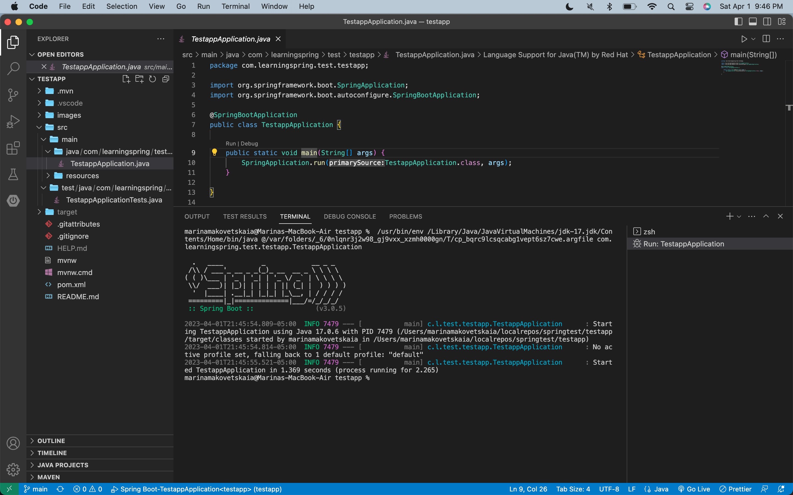
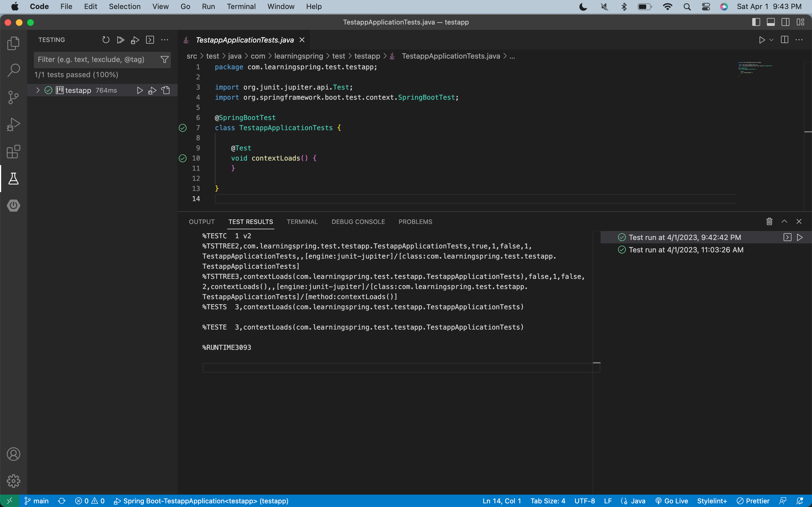

# Purpose

- Milestone 1: Sample project code added to Git from Spring template to let the team get familiar with Spring and practice git. Defined project and initial set of features areas team will work on.

 

## Project Members

| Member  | Feature                  | Notes   |
| ------- | ------------------------ | ------- |
| Ke      | Search                   | <i>Determine the search requirements: first need to understand the application search requirements, such as what to search for (product name, description, price, etc.), how to sort the search, the search results paging, etc.</i> |
| Zining  | Shopping Cart & Payments | <i>Shopping Cart may contains function: addProduct, deleteProduct, editQuantity, cartTotal.   Payment may contains function: changePaymentMethod, checkOut</i> |
| Alex    | Products                 | <i></i> |
| Pritesh | User & Merchant Module   | <ul><li>Sign-up and sign-in for different users based kn thier user roles, profile setup with contact and delivery details</li><li>stock management, merchant profile setup, delivery status update</li><li>theses features can be part of the user and merchant modules.</li></ul> |

 

## Conflict Resolution

First we will try to work through a conflict as a team, then we will try to vote, if there is a tie we will use a random number generator.
 

## Communication Mechanism

Discord is primary for both chat and meetings, email will be back-up.

 

## Decision Made

| #   | Area | Decision                    | Alternative | Rationale                            |
| --- | ---- | --------------------------- | ----------- | ------------------------------------ |
| 1   | IDE  | Will use VS Code as primary | IntelliJ    | Team is familiar with VS Code editor |

 

## Lessons Learned

 

## Meeting Notes

| # | Date | Note | Participants|
|---|------|------|-------------|
| 1 | 3.31.2023 | The team will consider best way to update git to set up project, for week 1 and Milestone 1 we are using a sample spring template with no project functionality as team is not familiar with Spring and also wants a project to practice git | Alex, Ke, Zining |

 

## Appendix

 
Working code example(s) by Alex

 
